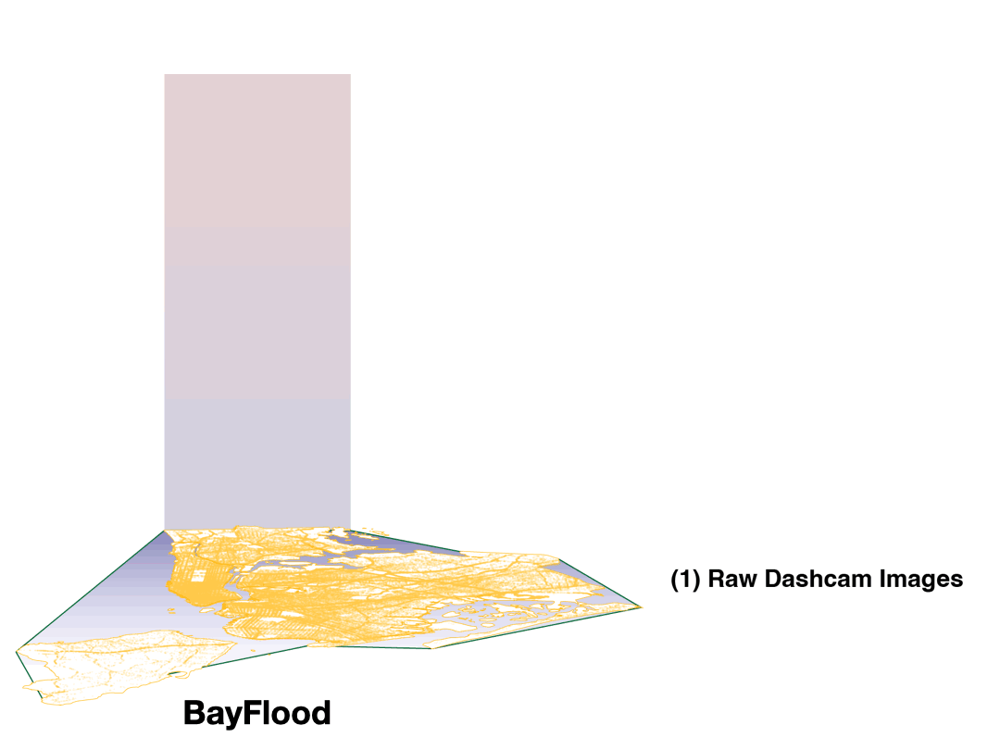

# Modeling Urban Street Flooding from Dense Street Imagery

A comprehensive analysis framework for detecting and analyzing urban street flooding using dashcam imagery, spatial modeling, and multiple data sources.



## Overview

This repository contains tools and analyses for understanding urban street flooding patterns in New York City using:

- **Dashcam imagery analysis** for automated flood detection
- **ICAR (Intrinsic Conditional Autoregressive) models** for spatial analysis
- **Bayesian inference** using Stan probabilistic programming
- **Multiple data sources**: 311 complaints, FloodNet sensors, census data, topographic data
- **Geospatial analysis** with NYC census tracts as the primary unit

## Scope and Key Features

- **Core focus (artifact scope)**: Bayesian spatial modeling (ICAR/CAR) via Stan with `icar_model.py`, and tract-level analysis CSVs via `analysis_df.py`.
- **Out of scope for this artifact**: Submodules `urbanECG`, `cambrian`, `Janus`, and paper repos `KDD-2025-Flooding-Paper`, `natcities_bayflood_2025` (kept as references only).
- **Optional visualization**: `generate_maps.py` can render geospatial maps but is not required for reproducing model outputs.

## Project Structure (relevant to ICAR pipeline)

```
bayflood/
├── icar_model.py              # Main ICAR modeling class
├── util.py                    # Utility functions for data processing
├── generate_maps.py           # Map generation and visualization
├── analysis_df.py             # Analysis DataFrame generation
├── logger.py                  # Logging utilities
├── refresh_cache.py           # Cache management
├── config.py                  # Centralized defaults; env overrides supported
├── observed_data.csv          # Processed flooding observations
├── stan_models/               # Stan model specifications
│   ├── weighted_ICAR_prior.stan
│   ├── proper_car_prior.stan
│   └── ...
├── notebooks/                 # Jupyter notebooks for analysis
│   ├── for_paper/            # Paper-specific analyses
│   ├── for_natcities/        # National Cities analysis
│   ├── for_floodnet/         # FloodNet sensor analysis
│   └── ...
├── data/                      # Data storage
│   ├── processed/            # Processed datasets
│   └── ...
├── aggregation/              # Aggregated data sources
│   ├── flooding/            # Flooding-related data
│   ├── demo/                # Demographic data
│   └── geo/                 # Geographic data
├── deliverables/             # Output files and visualizations
└── runs/                     # Model run outputs
```

## Installation

### Prerequisites

- Python 3.8 or higher
- Stan (PyStan) for Bayesian modeling
- Geographic data processing libraries
- Computer vision libraries for image analysis

### Environment Setup

1. **Clone the repository:**
   ```bash
   git clone <repository-url>
   cd bayflood
   ```

2. **Create a virtual environment:**
   ```bash
   conda create -n bayflood python=3.10
   conda activate bayflood
   ```

3. **Install dependencies (Python 3.10):**
   ```bash
   pip install -r requirements.txt  # or: pip install -r requirements-core.txt
   ```

   Or install manually:
   ```bash
   pip install pandas numpy scipy scikit-learn
   pip install geopandas matplotlib seaborn
   pip install stan pystan arviz
   pip install jupyter notebook
   pip install shapely pyproj
   ```

4. **Stan backend**: We use `stan` (httpstan) exclusively in this artifact. No CmdStan/PyStan required.

## Data Requirements

### Required Data Files

The analysis requires several data sources:

1. **Dashcam imagery data** (processed)
2. **Census tract boundaries** (GeoJSON format)
3. **Demographic data** (ACS 2023)
4. **311 complaint data**
5. **FloodNet sensor data**
6. **Topographic data**

### Data Organization

Place data files in the appropriate directories:
- Raw data: `data/`
- Processed data: `data/processed/`
- Aggregated data: `aggregation/`

## Quick Start

### 1. Basic ICAR Model Usage

```python
from icar_model import ICAR_MODEL

# Initialize model
model = ICAR_MODEL(
    PREFIX='test_run',
    ICAR_PRIOR_SETTING="icar",
    ANNOTATIONS_HAVE_LOCATIONS=True,
    EXTERNAL_COVARIATES=False,
    SIMULATED_DATA=False,
    ESTIMATE_PARAMS=['p_y', 'at_least_one_positive_image_by_area'],
    EMPIRICAL_DATA_PATH="data/processed/flooding_ct_dataset.csv"
)

# Load data
model.load_data()

# Fit model
fit = model.fit(CYCLES=1, WARMUP=1000, SAMPLES=1500)

# Generate results
model.plot_results(fit, model.data_to_use)
```

### 2. Generate Maps

```python
from generate_maps import generate_maps

# Generate flooding maps
generate_maps(
    run_id='test_run',
    estimate_path='runs/test_run/estimate_at_least_one_positive_image_by_area.csv',
    estimate='at_least_one_positive_image_by_area'
)
```

### 3. Analysis DataFrame

```python
from analysis_df import generate_nyc_analysis_df

# Generate comprehensive analysis
df = generate_nyc_analysis_df(
    run_dir='runs/test_run',
    custom_prefix='analysis',
    use_smoothing=True
)
```

## Usage Examples

### Running a Complete Analysis

1. **Prepare your data** according to the data requirements
2. **Configure model parameters** via CLI flags or environment variables in `config.py`
3. **Run the ICAR model** to get flooding estimates
4. **Generate visualizations** using `generate_maps.py`
5. **Perform additional analysis** using the notebooks

### Notebooks

Paper notebooks live in submodules and are out of scope for this artifact.

## Model Specifications

### ICAR Model

The ICAR (Intrinsic Conditional Autoregressive) model accounts for spatial dependencies in flooding patterns:

- **Spatial prior**: ICAR prior on tract-level flooding probabilities
- **Observation model**: Binomial likelihood for flood detection
- **Covariates**: Optional external covariates (demographics, topography)
- **Inference**: Hamiltonian Monte Carlo via Stan

### Stan Models

Located in `stan_models/`:
- `weighted_ICAR_prior.stan`: Standard ICAR model
- `proper_car_prior.stan`: Proper CAR model
- `ICAR_prior_annotations_have_locations.stan`: Model with annotation locations

## Outputs

### Model Outputs

- **Parameter estimates**: CSV files with posterior means and intervals
- **Diagnostic plots**: Convergence diagnostics, posterior distributions
- **Spatial maps**: Geographic visualizations of flooding risk

### Analysis Outputs

- **Comprehensive DataFrames**: Combined analysis with all covariates
- **Statistical summaries**: Correlation analyses, bias assessments
- **Visualizations**: Maps, plots, and interactive figures

## Citation

Add `CITATION.cff` in the repository root with your finalized citation. The `docs/README.md` references where to place it.

## License

Add a `LICENSE` file at the repository root.

## Contact

For questions or issues, please open a GitHub issue or contact [your email].

## Acknowledgments

- [List any acknowledgments, funding sources, etc.]
